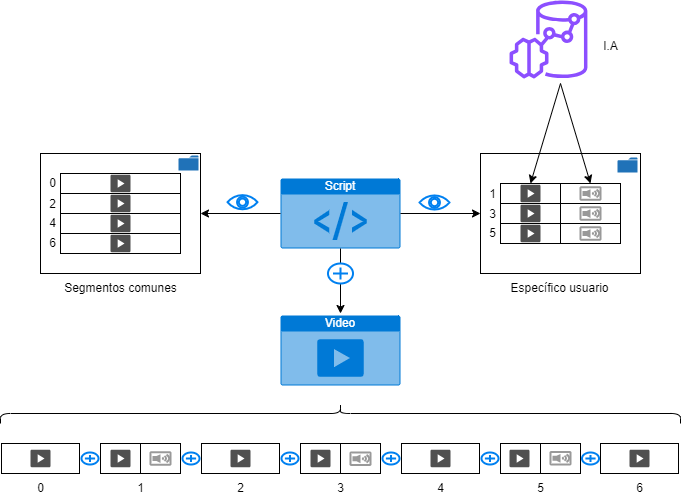

Simple script para agrupar distintos clips de video, tanto si vienen con audio incorporado como si no.

 ## Dependencias
 - **moviepy**: para el procesamiento de video *(se pueden utilizar otras alternativas)*
 - **python**: para ejecutar el script *(he probado con la version 3.11.8)*

 ## Organización de los ficheros
 - **/altered**: carpeta para cada usuario con los clips de video y audio modificados
    - Corresponde *(segun como lo he codificado)* a los id para los clips impares
 - **/original**: carpeta con los clips que no se van a modificar
    - Corresponde *(segun como lo he codificado)* a los id para los clips pares
 - **merge.py**: script y punto de acceso

 ## Ejecucion del programa
 ```bash
python merge.py
```

## Interpretacion del resultado
Por simplicidad, los clips de prueba son iguales entre pares (gato en positivo y jazz de fondo) y entre impares (gato en negativo y no-jazz de fondo).
Aun así, se pueden identificar por el numero del clip.
Recomendable no reproducir con el volumen al 100% :)



